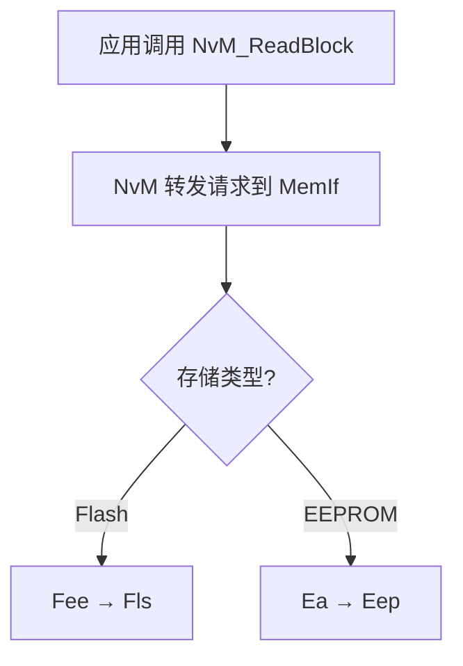

---
{"dg-publish":true,"dg-path":"01 车载技术/AUTOSAR 入门教程（4）MemStack（一）.md","permalink":"/01 车载技术/AUTOSAR 入门教程（4）MemStack（一）/"}
---

#Innolight

🚨 **AUTOSAR 的 Memory Stack 是车载 ECU 开发中最关键也最容易出错的模块之一**，它直接关系到车辆数据的可靠存储与快速访问。本文将深入解析 🔍 **NvM 模块** 的核心机制与最佳实践，帮助开发者避开常见的内存管理陷阱。

## 🏗️ 1. Memory Stack 架构解析

在 AUTOSAR 分层架构中，**Memory Stack** 是由一组模块组成的内存管理体系：

- 🔧 **服务层**：**NvM**（非易失性内存管理器）
- 🔌 **ECU 抽象层**：**MemIf**（内存接口）、**Fee**（Flash EEPROM 仿真）、**Ea**（EEPROM 抽象）
- 💽 **MCAL 层**：**Fls**（Flash 驱动）、**Eep**（EEPROM 驱动）

> 💡 关键设计原则：上层模块通过标准接口访问底层驱动，实现硬件无关的内存操作

## ⚙️ 2. NvM 模块服务类型对比

### 2.1 🔄 同步 vs 异步服务
| 特性 | 同步服务 | 异步服务 |
| - | - | - |
| 调用方式 | 阻塞式 | 非阻塞式 |
| 完成通知 | 轮询状态 | 回调函数 |
| 适用场景 | 简单操作 | 耗时操作 |

### 2.2 📋 典型服务函数
- 📥 `NvM_ReadBlock()`：同步读取
- 📤 `NvM_WriteBlock()`：同步写入
- 🔢 `NvM_SetDataIndex()`：设置数据集索引

## 🧩 3. NvM Blocks 配置实战

### 3.1 🔍 四种核心内存对象
1️⃣ **NV block**（必需）
   - 包含 block header + 数据区 + 可选 CRC
2️⃣ **RAM block**（必需）
   - 数据读写的高速缓存
3️⃣ **ROM block**（可选）
   - 故障恢复的默认值
4️⃣ **Administrative block**（必需）
   - 状态标记 + 数据长度

### 3.2 📊 三种 Block 类型配置
| 类型 | NV blocks | RAM block | ROM block | 典型应用 |
| - | - | - | - | - |
| Native | 1 | 1 | 1（可选） | 常规参数 |
| Redundant | 2 | 1 | 1（可选） | 安全关键数据 |
| Dataset | 1-255 | 1 | 1-n | 多配置参数 |

> ⚠️ 配置建议：冗余块建议用于里程、故障码等关键数据

## 🔄 4. 请求处理流程详解

### 4.1 🔄 单块请求流程（高频场景）

### 4.2 🔄 多块请求流程（系统级操作）
1️⃣ **启动时**：`NvM_ReadAll` 恢复 RAM 数据
2️⃣ **关闭时**：`NvM_WriteAll` 保存 RAM 数据
3️⃣ 典型触发点：
   - EcuM_Startup → 恢复运行时状态
   - EcuM_Shutdown → 保存用户设置

## 🏆 5. 最佳实践与避坑指南

- ⚠️ **异步回调陷阱**：确保回调函数执行时间 < 1ms
- ✅ **CRC 校验**：建议对安全相关数据启用
- 🔧 **块大小优化**：
  - Flash 块对齐：4KB 倍数
  - EEPROM 块：不超过页大小
- ❗ **错误处理**：
  - 实现 `NvM_JobErrorNotification`
  - 记录最后一次成功操作

> 💡 实战建议：开发阶段启用 `NvM_SetBlockProtection` 防止误写

通过合理配置 Memory Stack，开发者可以构建既满足功能安全要求，又具备高性能的内存管理系统。下一期我们将深入探讨 Fee 模块的磨损均衡算法实现。✨