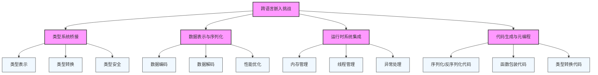
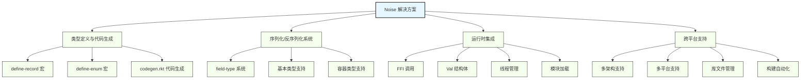
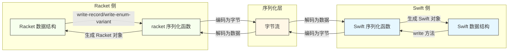
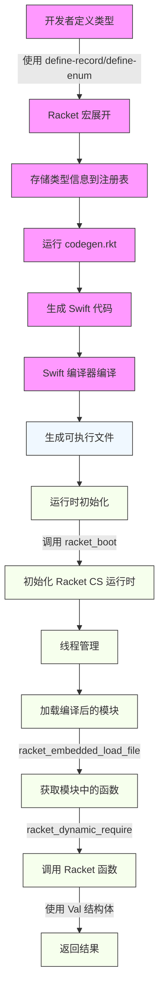
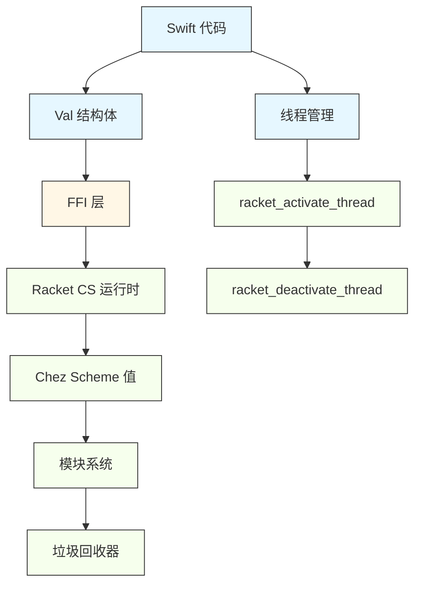

---
{"dg-publish":true,"dg-path":"03 Racket与函数式编程/从编译原理角度分析 Noise：Racket 嵌入 Swift 的实现.md","permalink":"/03 Racket与函数式编程/从编译原理角度分析 Noise：Racket 嵌入 Swift 的实现/"}
---

#lisp/racket  #gui/noise 

## 一、引言

将一种编程语言嵌入到另一种编程语言中，是一个涉及编译原理、运行时系统和跨语言交互的复杂问题。Noise 项目为我们提供了一个出色的范例，展示了如何将 Racket 无缝嵌入到 Swift 中。

本文将从编译原理的角度深入分析 Noise 项目，探讨其如何解决跨语言嵌入的核心挑战，包括：

- 类型系统的桥接
- 数据序列化与反序列化
- 代码生成与元编程
- 运行时系统的集成
- 跨平台编译与构建

## 二、编译原理视角下的核心挑战

### 2.1 跨语言类型系统桥接

Racket 和 Swift 拥有完全不同的类型系统：
- Racket 是动态类型语言，支持运行时类型检查和类型转换
- Swift 是静态类型语言，强调编译时类型安全

如何在这两种类型系统之间建立一座桥梁，是嵌入实现的核心挑战之一。这涉及到：

1. **类型表示**：如何在 Swift 中表示 Racket 的动态类型值
2. **类型转换**：如何在运行时安全地在两种类型系统之间转换值
3. **类型安全**：如何在保持 Swift 类型安全的同时，处理 Racket 的动态类型特性

### 2.2 数据表示与序列化

不同语言对数据的内存表示方式不同：
- Racket 使用 Chez Scheme 的值表示系统，基于指针和标记
- Swift 使用 LLVM 生成的原生数据表示，基于结构体和类

需要设计一套序列化/反序列化机制，确保数据在两种语言之间安全传递。这涉及到：

1. **数据编码**：如何将不同类型的数据编码为字节流
2. **数据解码**：如何从字节流中解码出对应类型的数据
3. **性能优化**：如何在保证正确性的同时，优化序列化/反序列化的性能

### 2.3 运行时系统集成

每种语言都有自己的运行时系统，负责内存管理、垃圾回收、异常处理等：
- Racket CS 运行时基于 Chez Scheme，使用保守式垃圾回收
- Swift 运行时基于 LLVM 和 Objective-C/Swift 运行时，使用自动引用计数

如何让这两个运行时系统和谐共存，是嵌入实现的关键挑战。这涉及到：

1. **内存管理**：如何协调两种不同的内存管理策略
2. **线程管理**：如何处理两种语言的线程模型差异
3. **异常处理**：如何在跨语言调用中正确传递和处理异常

### 2.4 代码生成与元编程

为了实现类型安全的跨语言交互，需要生成大量重复性代码：
- 为每种数据类型生成序列化/反序列化代码
- 为每种函数生成包装代码
- 为每种类型生成类型转换代码

如何自动化这个过程，是提高开发效率和代码质量的重要挑战。

### 2.5 核心挑战关系图



## 三、Noise 的编译原理解决方案

### 3.1 类型定义与代码生成

Noise 使用 Racket 的宏系统定义数据类型，并通过代码生成技术自动生成对应的 Swift 代码：

1. **类型定义**：使用 `define-record` 和 `define-enum` 宏定义数据结构
   ```racket
   (define-record Person
     [name : String]
     [age : Varint])
   ```

2. **宏展开**：Racket 宏系统展开这些定义，生成对应的结构体和访问器
   ```racket
   (struct Person (name age) #:transparent)
   (define (Person-name p) (Person-name p))
   (define (Person-age p) (Person-age p))
   ```

3. **信息存储**：将类型信息存储到全局注册表中
   ```racket
   (define info
     (record-info #f 'Person Person null
                  (list (record-field 'name String #f Person-name)
                        (record-field 'age Varint #f Person-age))))
   (store-record-info! info)
   ```

4. **代码生成**：通过 `codegen.rkt` 生成对应的 Swift 代码
   ```swift
   public struct Person: Readable, Sendable, Writable {
     public let name: String
     public let age: Varint
     
     public init(name: String, age: Varint) {
       self.name = name
       self.age = age
     }
     
     public static func read(from inp: InputPort, using buf: inout Data) -> Person {
       return Person(
         name: String.read(from: inp, using: &buf),
         age: Varint.read(from: inp, using: &buf)
       )
     }
     
     public func write(to out: OutputPort) {
       name.write(to: out)
       age.write(to: out)
     }
   }
   ```

### 3.2 序列化/反序列化系统

Noise 实现了一套完整的序列化/反序列化系统，基于字段类型系统：

1. **字段类型系统**：定义了 `field-type` 结构体，包含读取、写入和 Swift 类型生成方法
   ```racket
   (struct field-type (read-proc write-proc swift-proc))
   ```

2. **基本类型支持**：为每种基本类型实现了专用的序列化/反序列化逻辑
   ```racket
   (define-field-type String
     #:read (λ (in)
              (bytes->string/utf-8 (read-bytes (read-varint in) in)))
     #:write (λ (s out)
               (define bs (string->bytes/utf-8 s))
               (write-varint (bytes-length bs) out)
               (write-bytes bs out)))
   ```

3. **容器类型支持**：支持列表、哈希表、可选类型等复杂类型
   ```racket
   (define (Listof t)
     (let ([t (->field-type 'Listof t)])
       (define read-proc (field-type-read-proc t))
       (define write-proc (field-type-write-proc t))
       (define swift-type ((field-type-swift-proc t)))
       (field-type
        (λ (in)
          (for/list ([_ (in-range (read-varint in))])
            (read-proc in)))
        (λ (vs out)
          (write-varint (length vs) out)
          (for-each (λ (v) (write-proc v out)) vs))
        (λ ()
          (format "[~a]" swift-type)))))
   ```

4. **错误处理**：提供详细的错误信息，帮助调试序列化/反序列化问题
   ```racket
   (define (write-record info v [out (current-output-port)])
     (define last-field-id #f)
     (with-handlers ([exn:fail?
                      (lambda (e)
                        (define message
                          (format "~a~n  while writing record field: ~a.~a"
                                  (exn-message e)
                                  (record-info-name info)
                                  last-field-id))
                        (raise (exn:fail message (current-continuation-marks))))])
       (for ([f (in-list (record-info-fields info))])
         (define type (record-field-type f))
         (define value ((record-field-accessor f) v))
         (set! last-field-id (record-field-id f))
         (write-field type value out))))
   ```

### 3.3 运行时集成

Noise 通过以下方式集成 Racket CS 运行时：

1. **FFI 调用**：使用 Swift 的 C 互操作能力调用 Racket CS 运行时的 C API
   ```swift
   public init(execPath: String = "racket") {
     var args = racket_boot_arguments_t()
     args.exec_file = execPath.utf8CString.cstring()
     args.boot1_path = NoiseBoot.petiteURL.path.utf8CString.cstring()
     args.boot2_path = NoiseBoot.schemeURL.path.utf8CString.cstring()
     args.boot3_path = NoiseBoot.racketURL.path.utf8CString.cstring()
     racket_boot(&args)
     racket_deactivate_thread()
     // 释放内存
   }
   ```

2. **值包装**：实现 `Val` 结构体，包装 Chez Scheme 的值
   ```swift
   public struct Val {
     // 平台特定的指针表示
     #if os(iOS)
     let ptr: ptr
     #else
     let ptr: ptr?
     #endif
     
     // 各种值的创建和操作方法
     public static func fixnum(_ i: Int) -> Val { ... }
     public static func symbol(_ s: String) -> Val { ... }
     public func apply(_ args: Val) -> Val? { ... }
     // 更多方法...
   }
   ```

3. **线程管理**：提供线程激活和停用机制，确保线程安全
   ```swift
   public func bracket<T>(proc: () -> T) -> T {
     racket_activate_thread()
     let res = proc()
     racket_deactivate_thread()
     return res
   }
   ```

4. **模块加载**：支持加载编译后的 Racket 模块（.zo 文件）
   ```swift
   public func load(zo: URL) {
     let path = zo.path.utf8CString.cstring()
     racket_embedded_load_file(path, 1)
     path.deallocate()
   }
   ```

### 3.4 跨平台编译与构建

Noise 使用 Makefile 和脚本实现跨平台支持：

1. **多架构支持**：支持 x86_64 和 arm64 架构
   ```makefile
   Lib/libracketcs-universal-macos.a:
	make -C Lib libracketcs-universal-macos.a
   ```

2. **多平台支持**：支持 macOS 和 iOS 平台
   ```makefile
   RacketCS-ios.xcframework: Lib/include/* Lib/libracketcs-arm64-ios.a Lib/libracketcs-arm64-iphonesimulator.a
	rm -fr $@
	xcodebuild -create-xcframework \
		-library Lib/libracketcs-arm64-iphonesimulator.a -headers Lib/include \
		-library Lib/libracketcs-arm64-ios.a -headers Lib/include \
		-output $@
   ```

3. **库文件管理**：提供脚本复制和合并适合目标平台的库文件
   ```bash
   ./Bin/copy-libs.sh arm64-macos /path/to/src/racket
   ```

4. **构建自动化**：使用 Makefile 自动化构建流程
   ```makefile
   all: \
	RacketCS-ios.xcframework \
	RacketCS-macos.xcframework \
	Tests/NoiseTest/Modules/mods.zo
   ```

### 3.5 Noise 解决方案架构图



## 四、编译流程解析

### 4.1 类型定义与代码生成流程

1. **类型定义**：开发者使用 `define-record` 和 `define-enum` 宏定义数据结构
2. **宏展开**：Racket 宏系统展开这些定义，生成对应的结构体和访问器
3. **信息存储**：将类型信息存储到全局注册表中
4. **代码生成**：运行 `codegen.rkt` 生成对应的 Swift 代码
5. **Swift 编译**：Swift 编译器编译生成的代码和手动编写的代码

### 4.2 运行时初始化与模块加载流程

1. **运行时初始化**：Swift 代码调用 `racket_boot` 初始化 Racket CS 运行时
2. **线程管理**：调用 `racket_deactivate_thread` 停用当前线程
3. **模块加载**：调用 `racket_embedded_load_file` 加载编译后的 Racket 模块
4. **函数调用**：通过 `racket_dynamic_require` 获取模块中的函数
5. **值传递**：使用 `Val` 结构体在 Swift 和 Racket 之间传递值

### 4.3 数据序列化/反序列化流程

1. **序列化**：将 Swift 或 Racket 数据转换为字节流
   - 对于基本类型，直接转换为对应的字节表示
   - 对于复杂类型，递归序列化其组成部分

2. **反序列化**：将字节流转换为 Swift 或 Racket 数据
   - 读取类型标签和长度信息
   - 根据类型信息递归反序列化数据

#### 4.3.1 序列化/反序列化流程图



### 4.4 完整编译流程图



## 五、核心实现技术分析

### 5.1 宏系统与元编程

Noise 充分利用了 Racket 的宏系统：

1. **语法扩展**：使用宏定义新的语法形式，如 `define-record` 和 `define-enum`
   ```racket
   (define-syntax (define-record stx)
     (syntax-parse stx
       [(_ {~or name:id (name:id : proto:protocol ...+)} fld:record-field ...)
        ;; 宏展开逻辑
        #'(begin
            ;; 生成结构体定义
            ;; 生成访问器函数
            ;; 生成类型信息
            )]))
   ```

2. **类型信息收集**：在宏展开时收集类型信息，为代码生成做准备
   ```racket
   (define info
     (let ([protocols {~? (list proto.e ...) null}]
           [fields (list (record-field 'fld.id (->field-type 'Record fld.ft) fld.mut? fld-accessor-id) ...)])
       (record-info #f 'name -name protocols fields)))
   (store-record-info! info)
   ```

3. **代码生成**：使用宏生成重复性代码，减少手动编写的工作量
   ```racket
   (define-syntax (define-field-type stx)
     (syntax-parse stx
       [(_ id:id
           {~alt
            {~optional {~seq #:read read-expr:expr}}
            {~optional {~seq #:write write-expr:expr}}
            {~optional {~seq #:swift swift-expr:expr}}} ...)
        #'(begin
            (define id (field-type read-expr write-expr (~? swift-expr (λ () (symbol->string 'id)))))
            (provide id))]))
   ```

### 5.2 字段类型系统

Noise 实现了一个灵活的字段类型系统：

1. **类型抽象**：使用 `field-type` 结构体抽象不同类型的序列化/反序列化行为
   ```racket
   (struct field-type
     (read-proc write-proc swift-proc))
   ```

2. **类型组合**：支持通过组合基本类型创建复杂类型，如 `Listof` 和 `HashTable`
   ```racket
   (define (HashTable k v)
     (let ([k (->field-type 'HashTable k)]
           [v (->field-type 'HashTable v)])
       (define k-read-proc (field-type-read-proc k))
       (define v-read-proc (field-type-read-proc v))
       (define k-write-proc (field-type-write-proc k))
       (define v-write-proc (field-type-write-proc v))
       (define k-swift-type ((field-type-swift-proc k)))
       (define v-swift-type ((field-type-swift-proc v)))
       (field-type
        (λ (in)
          (for/hash ([_ (in-range (read-varint in))])
            (values
             (k-read-proc in)
             (v-read-proc in))))
        (λ (h out)
          (write-varint (hash-count h) out)
          (for ([(k v) (in-hash h)])
            (k-write-proc k out)
            (v-write-proc v out)))
        (λ ()
          (format "[~a: ~a]"
                  k-swift-type
                  v-swift-type)))))
   ```

3. **类型延迟**：使用 `Delay` 类型支持递归类型定义
   ```racket
   (define-syntax-rule (Delay e)
     (Delay* (λ () e)))

   (define (Delay* t-proc)
     (define (force)
       (->field-type 'Delay (t-proc)))
     (field-type
      (λ (in) ((field-type-read-proc (force)) in))
      (λ (v out) ((field-type-write-proc (force)) v out))
      (λ () ((field-type-swift-proc (force))))))
   ```

### 5.3 跨语言 FFI 调用

Noise 通过 FFI 调用实现与 Racket CS 运行时的交互：

1. **C API 封装**：封装 Racket CS 运行时的 C API
   ```swift
   public func require(_ what: Val, from mod: Val) -> Val {
     return Val(ptr: racket_dynamic_require(mod.ptr, what.ptr))
   }
   ```

2. **值表示转换**：在 Swift 和 Chez Scheme 值表示之间进行转换
   ```swift
   public static func fixnum(_ i: Int) -> Val {
     #if os(iOS)
     return Val(ptr: racket_fixnum(Int64(i)))
     #else
     return Val(ptr: racket_fixnum(i))
     #endif
   }
   ```

3. **内存管理**：确保内存安全，避免内存泄漏和悬挂指针
   ```swift
   public init(execPath: String = "racket") {
     // 初始化代码
     args.exec_file.deallocate()
     args.boot1_path.deallocate()
     args.boot2_path.deallocate()
     args.boot3_path.deallocate()
   }
   ```

#### 5.3.1 运行时集成架构图



### 5.4 代码生成技术

Noise 使用代码生成技术自动生成 Swift 代码：

1. **模板化代码生成**：使用模板生成重复性代码
   ```racket
   (define (write-record-code r [out (current-output-port)])
     (match-define (record-info _id name _constructor protocols fields) r)
     (define ~protocols
       (let ([protocols (append protocols '(Readable Sendable Writable))])
         (string-join (map symbol->string protocols) ", ")))
     (fprintf out "public struct ~a: ~a {~n" name ~protocols)
     ;; 生成字段定义
     ;; 生成初始化方法
     ;; 生成读取方法
     ;; 生成写入方法
     (fprintf out "}
"))
   ```

2. **类型安全保证**：生成类型安全的 Swift 代码
   ```racket
   (define (swift-type t)
     ((field-type-swift-proc t)))
   ```

3. **错误处理**：在生成的代码中包含适当的错误处理
   ```swift
   public static func read(from inp: InputPort, using buf: inout Data) -> ~a {
     let tag = UVarint.read(from: inp, using: &buf)
     switch tag {
     case ~a:
       return .~a
     // 其他情况
     default:
       preconditionFailure("~a: unexpected tag \(tag)")
     }
   }
   ```

## 六、从 Noise 到其他语言：编译原理的普适性

### 6.1 核心原理迁移

将 Noise 的编译原理经验应用到其他语言中，需要考虑以下几点：

1. **类型系统分析**：分析目标语言的类型系统特性
   - 静态类型 vs 动态类型
   - 类型推断能力
   - 泛型支持
   - 类型擦除 vs 运行时类型信息

2. **运行时集成**：了解目标语言的运行时系统
   - 内存管理策略
   - 线程模型
   - 异常处理机制
   - 与 C 代码的互操作性

3. **FFI 机制**：利用目标语言的 FFI 机制与 Racket CS 运行时交互
   - C 互操作性
   - 指针处理
   - 内存管理
   - 调用约定

4. **代码生成**：使用目标语言支持的元编程或代码生成技术
   - 模板系统
   - 宏系统
   - 反射
   - 外部代码生成工具

#### 6.1.1 跨语言迁移架构图

```mermaid
graph TD
    subgraph Core[核心原理层]
        A[类型系统桥接]
        B[数据序列化/反序列化]
        C[运行时集成]
        D[代码生成]
    end
    
    subgraph Implementation[语言特定实现层]
        E[Swift 实现]
        F[C# 实现]
        G[Java 实现]
        H[Python 实现]
    end
    
    Core --> Implementation
    
    A --> E1[Val 结构体]
    A --> F1[RacketValue 类]
    A --> G1[RacketObject 类]
    A --> H1[RacketValue 类]
    
    B --> E2[NoiseSerde]
    B --> F2[RacketSerializer]
    B --> G2[RacketSerializer]
    B --> H2[RacketSerializer]
    
    C --> E3[FFI 封装]
    C --> F3[P/Invoke]
    C --> G3[JNI]
    C --> H3[ctypes]
    
    D --> E4[codegen.rkt]
    D --> F4[CodeGenerator]
    D --> G4[CodeGenerator]
    D --> H4[CodeGenerator]
    
    E1 --> E
    E2 --> E
    E3 --> E
    E4 --> E
    
    F1 --> F
    F2 --> F
    F3 --> F
    F4 --> F
    
    G1 --> G
    G2 --> G
    G3 --> G
    G4 --> G
    
    H1 --> H
    H2 --> H
    H3 --> H
    H4 --> H
    
    classDef core fill:#e6f7ff,stroke:#333,stroke-width:2px
    classDef impl fill:#f6ffed,stroke:#333,stroke-width:1px
    classDef lang fill:#fff7e6,stroke:#333,stroke-width:1px
    
    class A,B,C,D core
    class E1,E2,E3,E4,F1,F2,F3,F4,G1,G2,G3,G4,H1,H2,H3,H4 impl
    class E,F,G,H lang
```



### 6.2 C# 实现示例

以 C# 为例，实现步骤包括：

1. **P/Invoke 接口**：定义与 Racket CS 运行时交互的 P/Invoke 接口
   ```csharp
   [DllImport("libracketcs")]
   private static extern void racket_boot(ref RacketBootArguments args);
   
   [DllImport("libracketcs")]
   private static extern void racket_deactivate_thread();
   
   [DllImport("libracketcs")]
   private static extern IntPtr racket_dynamic_require(IntPtr mod, IntPtr what);
   ```

2. **类型系统桥接**：实现 C# 和 Racket 之间的类型转换
   ```csharp
   public class RacketValue {
     private IntPtr ptr;
     
     public static RacketValue FromInt(int value) {
       // 调用 racket_fixnum 创建 fixnum
     }
     
     public static RacketValue FromString(string value) {
       // 调用 racket_string 创建字符串
     }
     
     public object ToObject() {
       // 根据类型转换为对应的 C# 对象
     }
   }
   ```

3. **序列化/反序列化**：实现数据序列化/反序列化系统
   ```csharp
   public interface ISerializable {
     void Write(Stream output);
     void Read(Stream input);
   }
   
   public class StringSerializer : ISerializable {
     public void Write(Stream output, string value) {
       // 序列化字符串
     }
     
     public string Read(Stream input) {
       // 反序列化字符串
     }
   }
   ```

4. **运行时管理**：管理 Racket CS 运行时的生命周期
   ```csharp
   public class RacketRuntime : IDisposable {
     public RacketRuntime(string execPath = "racket") {
       // 初始化 Racket 运行时
     }
     
     public void LoadModule(string zoPath) {
       // 加载编译后的模块
     }
     
     public void Dispose() {
       // 清理资源
     }
   }
   ```

## 七、编译原理视角的总结

从编译原理的角度看，Noise 项目的成功之处在于：

1. **类型系统桥接**：通过宏定义和代码生成，在 Racket 和 Swift 之间建立了类型安全的桥接
   - 使用 Racket 宏定义数据结构
   - 自动生成对应的 Swift 代码
   - 保持类型安全的同时，支持动态类型特性

2. **序列化系统**：实现了一套完整的序列化/反序列化系统，确保数据在不同语言之间安全传递
   - 基于字段类型的序列化框架
   - 支持基本类型和复杂类型
   - 提供详细的错误信息

3. **运行时集成**：通过 FFI 调用和值包装，实现了 Racket CS 运行时与 Swift 运行时的和谐共存
   - 封装 C API 调用
   - 管理线程状态
   - 处理内存分配和释放

4. **代码生成**：利用 Racket 的元编程能力，自动生成重复性代码，提高开发效率
   - 模板化代码生成
   - 类型安全保证
   - 错误处理

5. **跨平台支持**：通过条件编译和构建系统，实现了跨平台支持
   - 支持多架构和多平台
   - 自动化构建流程
   - 库文件管理

## 八、结论

Noise 项目展示了如何从编译原理的角度解决跨语言嵌入的核心挑战。通过巧妙地结合 Racket 的元编程能力和 Swift 的类型安全特性，它创建了一个无缝的嵌入体验。

这种基于编译原理的方法不仅适用于 Racket 嵌入 Swift，也可以推广到其他语言的嵌入场景中。无论是嵌入到 C#、Java 还是其他语言，核心挑战和解决方案都是相似的：建立类型系统桥接、实现序列化/反序列化、集成运行时系统、生成类型安全的代码。

通过理解 Noise 的编译原理实现，我们可以更好地设计和实现其他跨语言嵌入系统，为不同编程语言之间的互操作开辟新的可能性。同时，这也加深了我们对编译原理、类型系统和运行时系统的理解，为我们解决更复杂的软件 engineering 问题提供了新的思路。